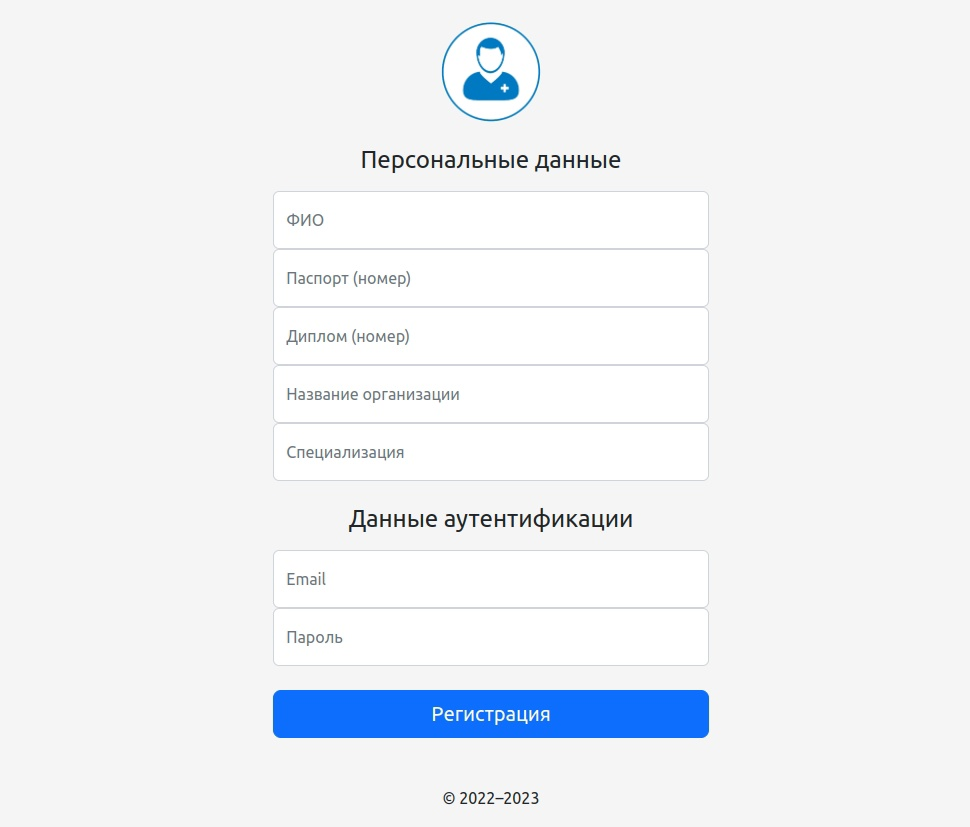
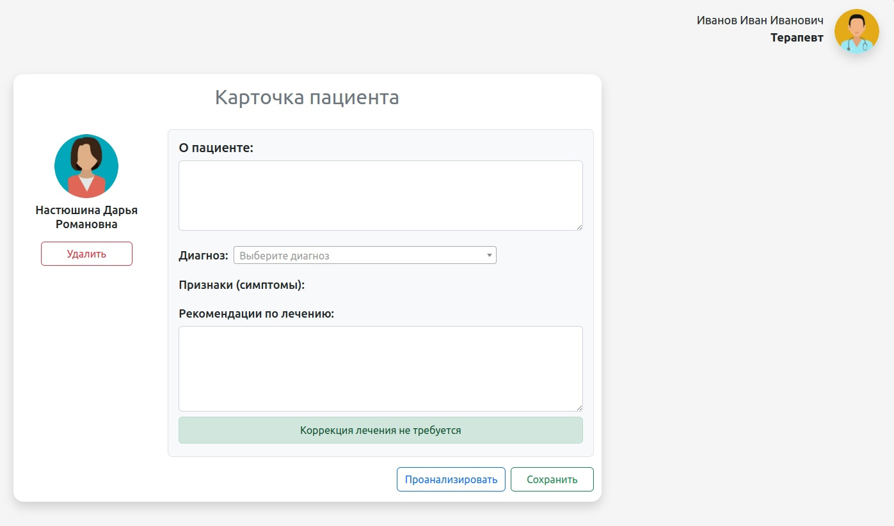
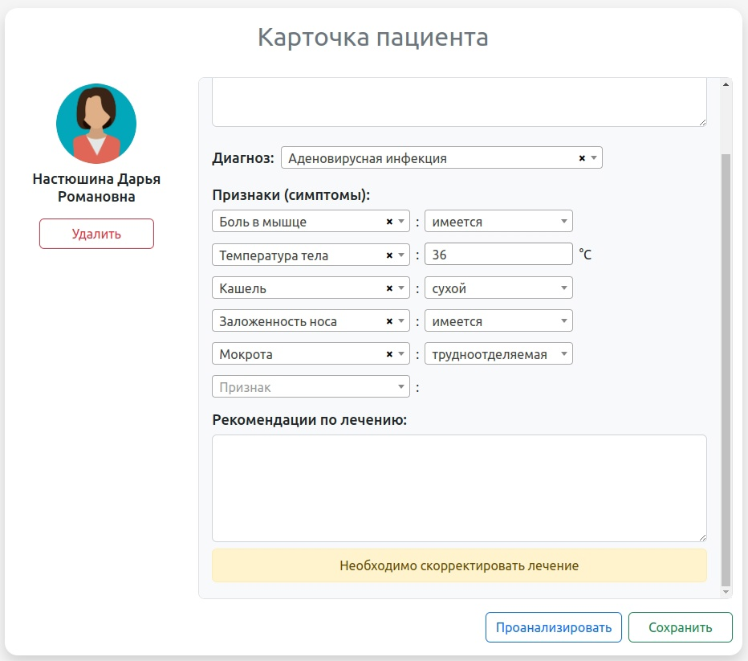
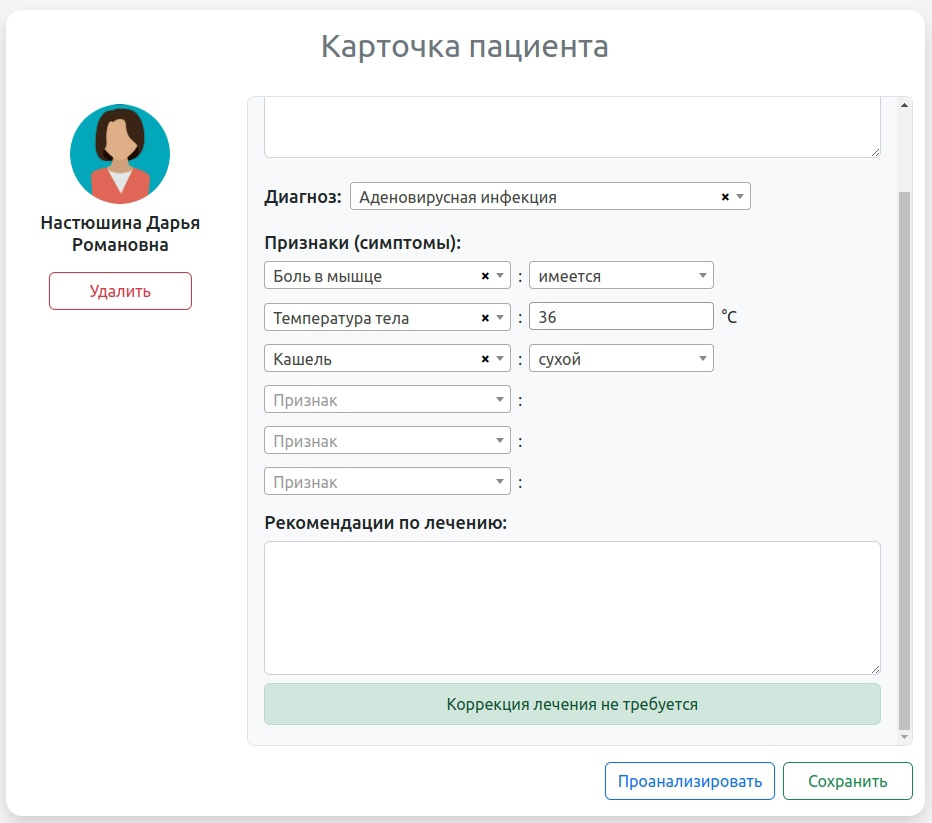
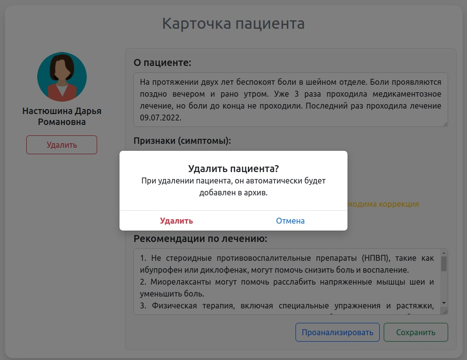

## Описание проекта
Данный проект представляет собой интеллектуальную систему, которая на основе признаково 
описания заболевания пациента и пройденного времени лечения формирует оценку необходимости 
коррекции лечения на основе данных, которые вносятся на проятжении всего периода лечения.

## Интерфейс
### Регистрация

### Аутентификация

### Карточка пациента (начальное состояние)

### Карточка пациента (необходима коррекция лечения)

### Карточка пациента (коррекция лечения не требуется)

### Карточка пациента (перемещение пациента в архив)

### Интерактивная иконка профиля

## Стек технологий
- PHP `v8.1`
- JQuery `v3.7`
- Laravel `v10.10.1`
- Bootstrap `v5.2.3`
- Composer `v2.5.5`
- Npm `v9.6.4`
- MySQL
- PhpStorm
